# 🎯 Employee Retention Strategy
### Reducing Employee Attrition — A Data-Driven POC Proposal


---

## 📌 Overview

Employee attrition is a silent but expensive problem. This project delivers a **proof-of-concept (POC)** for a **predictive machine learning solution** that identifies employees at high risk of leaving, so HR can intervene *before* they walk out the door.

Using predictive analytics, we help organizations shift from **reactive retention** (replacing people after they leave) to **proactive retention** (keeping the best people before they decide to go).

> 💰 **Baseline annual loss from attrition:** ~$17.2 Million  
> 📉 **Projected preventable savings:** ~$1.47 Million per year  
> 📈 **Return on Investment (ROI):** **270%**

---

## ⭐ Key Project Highlights

| 🏆 Highlight | 📊 Result | 💡 Why It Matters |
|---|---|---|
| **Winning Model** | Logistic Regression | Chosen over XGBoost, Random Forest, Gradient Boosting |
| **Recall (Attrition Class)** | **91.5%** | Captures nearly all leavers — critical given 39:1 cost ratio |
| **ROC-AUC Score** | **0.7985** | Best separation between leavers & stayers |
| **F1-Score** | **0.4394** | Highest among all 4 models tested |
| **Optimized Threshold** | 0.18 (vs. default 0.50) | 3x more leavers caught → $1.47M net savings |
| **Net Annual Savings** | **$1,470,308** | Direct impact on bottom line |
| **ROI (Year 1)** | **270.80%** | Every $1 invested → $2.71 returned |
| **ROI (Full Scale)** | **743%** | Enterprise-wide projected return |
| **Features Engineered** | 35 → 58 (+23) | +7.1% accuracy, 3x actionable insights |
| **High-Risk Employees Flagged** | 181 of 1,470 | Targeted, cost-effective intervention |
| **Cost Ratio (FN:FP)** | **39 : 1** | Justifies aggressive recall-first strategy |

---

## 🚨 The Business Problem

| Pain Point | Impact |
|---|---|
| **Reactive HR practices** | Interventions happen only after resignations |
| **High replacement cost** | $117,053 per departing employee (~1.5x salary) |
| **Knowledge drain** | Institutional expertise walks out the door |
| **Team disruption** | Morale and productivity decline with every exit |
| **Generic interventions** | One-size-fits-all retention wastes resources |

The client is losing **over $17 Million annually** due to unmanaged turnover.

---

## 🎯 Objectives

1. **Identify** employees most likely to leave within the next 12 months.
2. **Rank** them by risk level to enable targeted interventions.
3. **Quantify** the financial impact of a full-scale solution.

### Success KPIs
- ✅ ≥ 10% reduction in attrition among flagged employees
- ✅ Positive ROI vs. cost of interventions
- ✅ Adoption readiness for full-scale deployment

---

## 🏗️ Architecture & ML Pipeline

```mermaid
flowchart TD
    A[Raw HR Dataset<br/>1,470 Records • 44 Attributes] --> B[Data Cleaning & Preparation<br/>Dropped Constants: EmployeeCount, StandardHours, Over18, EmployeeNumber]
    B --> C[Cleaned Dataset<br/>1,470 Employee Profiles • 40 Features]
    C --> D[Exploratory Data Analysis<br/>Univariate & Bivariate Risk Diagnostics<br/>Income Gap • Overtime • Promotion Stagnation]
    D --> E[Feature Engineering<br/>35 → 58 Features +23 Engineered]
    E --> F[Feature Preprocessing<br/>Target Encoding JobRole • One-Hot OverTime/BusinessTravel<br/>StandardScaler on Continuous Vars]
    F --> G[Stratified Train/Test Split<br/>80% Train • 20% Test<br/>Preserving Attrition Class Balance]
    G --> H[Model Training<br/>Logistic Regression • Random Forest<br/>XGBoost • Gradient Boosting]
    H --> I[Model Evaluation<br/>Accuracy • Precision • Recall • F1 • ROC-AUC]
    I --> J[Model Selection<br/>⭐ Logistic Regression<br/>Highest Recall 61.7% • Highest ROC-AUC 0.7985]
    J --> K[Threshold Optimization<br/>0.50 → 0.18<br/>Recall 61.7% → 91.5%]
    K --> L[Financial Impact Quantification<br/>181 Flagged Employees<br/>Net Savings $1,470,308 • ROI 270.8%]
    L --> M[Business Strategy & HR Consulting<br/>Compensation Reviews • Overtime Reduction<br/>Career Pathing • Role-Specific Retention]

```

---

## 🔍 EDA Key Findings

| 📊 Finding | 📈 Insight | 💼 Business Implication |
|---|---|---|
| **Monthly Income Gap** | Leavers earned **$2,046/month less** ($4,787 vs. $6,833) — a **29.9% gap** | **Most critical predictor** — compensation review for low-income staff |
| **Tenure Difference** | Stayers had **3.6 more years** of experience (11.9 vs. 8.2) | Early-tenure employees are highest risk; onboarding matters |
| **Sales Rep Crisis** | **39.8% attrition** — 2.5x company average | Highest-risk role; needs role-specific retention program |
| **Overtime Problem** | 413 employees (28%) work OT; 126 likely to leave → **~$10M issue** | Overtime is a top retention lever, not just an ops metric |
| **Income Threshold Effect** | Below $3,500 → **37% attrition**; Above → only **8%** | A **29-point gap** — cleanest risk cut-off identified |
| **Promotion Stagnation** | 3+ years without promotion → **28–33% attrition**; <1 year → only **9%** | Career progression is a critical retention driver |
| **Demographic Risk** | Single employees leave at **25.5%** | Different life priorities / lower stability — tailor programs |
| **Low Satisfaction** | Job Satisfaction < 2 → **2.1x higher attrition** | Satisfaction surveys are early-warning signals |
| **High-Risk Profile** | Income < $3K + Overtime + No promotion >3 yrs + Satisfaction < 2 | **127 employees** in "Danger Zone" → $4.2–6.3M annual cost |
| **Company vs. Industry** | Attrition **16.10%** vs. industry **12–15%** (+1.1 to +4.1pp) | Company is bleeding talent faster than peers |

### 🚩 HIGH-RISK TRIGGER RULES
Employees are flagged as **HIGH RISK** when **ANY** of the following is true:

| # | Rule | Multiplier |
|---|---|---|
| 1️⃣ | Monthly Income < $3,000 | Baseline |
| 2️⃣ | Overtime = Yes | **1.8x** higher attrition |
| 3️⃣ | Years Since Last Promotion > 3 | **1.6x** higher |
| 4️⃣ | Job Satisfaction < 2 | **2.1x** higher |

---

## 🧠 Feature Engineering

Expanded features from **35 → 58** via:

| Type | Purpose | Example |
|---|---|---|
| **Ratio Creation** | Quantify career stagnation & undervaluation | `Income per Year = MonthlyIncome / TotalWorkingYears` |
| **Categorical Encoding** | Convert categories to numeric risk scores | Target Encoding for `JobRole`, One-Hot for `OverTime` |
| **Numerical Scaling** | Normalize inputs for Logistic Regression | `StandardScaler` on all continuous vars |

**Tier 1 — Business Logic Features:**
- **Compensation Equity:** `Income_vs_Department_Avg`, `Income_vs_Role_Avg`, `Salary_Compression_Ratio`
- **Career Progression:** `Promotion_Velocity`, `Career_Stagnation_Flag`, `Tenure_to_Promotion_Ratio`
- **Workload:** `Relative_Overtime`, `Work_Intensity_Score`

**Tier 2 — Interaction Features (High-Impact Combos):**
- `HighPressure_Employee = Overtime + Low Income (<$3,500)`
- `HighPotential_Underpaid = Young (<35) + Experienced (>5 yrs) + Underpaid`
- `Career_Blocked = Stagnant (>3 yrs no promo) + Dissatisfied (score ≤ 2)`

**📈 Impact:** +7.1% accuracy boost | 3x more actionable insights | Better model interpretability.

---

## 🎯 Model Comparison & Selection

### The 4 Models Tested

| Model | 📖 Description | 🎯 What It Achieved |
|---|---|---|
| **⭐ Logistic Regression** | Linear model that estimates the probability of attrition using a sigmoid function. Assumes linear relationship between features and log-odds. | **Highest Recall (61.7%)**, Highest F1 (0.4394), Highest ROC-AUC (0.7985). Baseline interpretable model. **WINNER.** |
| **Random Forest** | Ensemble of decision trees trained on random subsets of data & features. Handles non-linearity and noise. | Balanced accuracy (83.33%) but poor at catching leavers (Recall = 31.9%). Misses ~68% of exits. |
| **XGBoost** | Gradient boosting on steroids — sequential trees that correct previous errors. Industry standard for tabular data. | High accuracy (85.03%) but dangerously low Recall (34.0%). Misses 2 out of 3 leavers. |
| **Gradient Boosting** | Sequential ensemble that builds trees to minimize loss. Strong on structured data. | **Highest Accuracy (85.37%)** but **lowest Recall (19.2%)** — misses 81% of leavers. Unacceptable financial risk. |

### 📊 Performance Metrics Table

| Model | Accuracy | Precision | F1-Score | ROC-AUC | **Recall** ⭐ |
|---|---|---|---|---|---|
| **⭐ Logistic Regression** | 0.7483 | 0.3412 | **0.4394** | **0.7985** | **0.6170** |
| XGBoost | 0.8503 | 0.5517 | 0.4211 | 0.7668 | 0.3404 |
| Random Forest | 0.8333 | 0.4688 | 0.3797 | 0.7815 | 0.3191 |
| Gradient Boosting | **0.8537** | 0.6429 | 0.2951 | 0.7887 | 0.1915 |

### 🎓 Key Takeaways

> ### 🏆 Why Logistic Regression Wins

✅ **Highest Recall (61.7%)** — finds **2–3x more actual leavers** than any other model  
✅ **Highest ROC-AUC (0.7985)** — best at ranking high-risk vs. low-risk employees  
✅ **Highest F1-Score (0.4394)** — best overall balance for the imbalanced attrition class  
✅ **Clear Risk Interpretation** — coefficients explain *why* an employee is at risk  
✅ **Regulatory & Ethical Compliance** — explainable, auditable, bias-detectable, GDPR-ready

> ### ⚠️ Why the "High Accuracy" Models Were Rejected

❌ **Accuracy is misleading** — with 16% attrition, a model predicting "no one leaves" gets 84% accuracy but 0% recall  
❌ **Tree models missed 66–81% of leavers** — unacceptable given $117K cost per missed leaver  
❌ **No explainability** — "85% risk" tells HR nothing actionable (vs. "73% risk due to Income -28%, Promotion +22%")  
❌ **Financial risk** — missing 81% of leavers creates **$3.65M in preventable turnover loss**

> ### 💡 The Money-Quote Insight
> **For every $100,000 spent on retention programs:**
> - 🔴 Gradient Boosting reaches **19 actual leavers**
> - 🟡 XGBoost reaches **34 actual leavers**
> - 🟢 **Logistic Regression reaches 62 actual leavers** → **3.3x better targeting**

---

## ⚙️ Decision Threshold Tuning for HR Business Value

### Why the Default 0.50 Threshold Fails HR

The default 0.50 threshold treats **False Positives and False Negatives as equally costly** — this is mathematically "correct" but **financially wrong** for HR.

In employee attrition, the costs are **wildly asymmetric**:

| Error Type | Meaning | Cost |
|---|---|---|
| ❌ **False Negative (FN)** | Employee leaves — we failed to flag them | **$117,053** |
| ⚠️ **False Positive (FP)** | Employee stays — we wasted an intervention | **$3,000** |

### 💡 The 39:1 Cost Ratio


> **Every 1 missed leaver costs the same as ~39 unnecessary interventions.**

This 39:1 asymmetry mathematically justifies **shifting the threshold down** to catch more leavers — even at the cost of more false alarms.

### 📉 Threshold Tuning in Practice

| Threshold | Precision | Recall | False Negatives | Net Savings |
|---|---|---|---|---|
| **0.50 (Default)** | High | 61.7% | Many missed leavers | $750,000 |
| **0.18 (Optimized)** | Lower | **91.5%** | Few missed leavers | **$1,470,308** |

### 🎯 The Business Logic Behind 0.18

- **Action:** Flag any employee with **≥ 18% probability of leaving** for a $3,000 intervention.
- **Result:** Captures **91.5% of all leavers** while keeping intervention cost 39x below replacement cost.
- **Financial Outcome:** **$1.47M net annual savings** vs. $750K at default threshold.
- **Risk Mitigation:** Only $3K risk per FP vs. $117K risk per FN.

> ### 💰 The 0.18 Sweet Spot
> Instead of asking *"Is this person definitely leaving?"* (0.50), we ask  
> **"Is it financially worth spending $3K to potentially save $117K?"** (0.18)  
> At 18%, the expected value of intervening is still positive — making 0.18 the **mathematically optimal business threshold**.

---

## 🔬 Feature Influence & Risk Drivers

### 📊 Top Predictors Ranked by Impact

| Rank | Feature | Influence | Direction | Business Meaning |
|---|---|---|---|---|
| 🥇 | **Monthly Income** | **Highest** | ⬇️ Lower income → Higher risk | 29.9% gap between leavers & stayers |
| 🥈 | **Overtime** | **Very High** | ⬆️ OT = Yes → 1.8x risk | Workload burnout driver |
| 🥉 | **Years Since Last Promotion** | **High** | ⬆️ >3 yrs → 1.6x risk | Career stagnation penalty |
| 4️⃣ | **Job Satisfaction** | **High** | ⬇️ Score < 2 → 2.1x risk | Early-warning signal |
| 5️⃣ | **Job Role (Sales Rep)** | **High** | ⬆️ 39.8% attrition rate | Role-specific burnout |
| 6️⃣ | **Total Working Years** | **Medium** | ⬇️ Early career → Higher risk | Less "sunk cost" to leave |
| 7️⃣ | **Age** | **Medium** | ⬇️ Younger → Higher risk | Mobility & opportunity seeking |
| 8️⃣ | **Marital Status (Single)** | **Medium** | ⬆️ 25.5% attrition | Lower stability / fewer anchors |
| 9️⃣ | **Work-Life Balance** | **Medium** | ⬇️ Poor balance → Higher risk | Compounded by OT |
| 🔟 | **Environment Satisfaction** | **Low-Med** | ⬇️ Low satisfaction → Higher risk | Culture & management signal |

### 🧬 Engineered Features That Added Predictive Power

| Feature | Type | What It Reveals |
|---|---|---|
| `Income per Year` | Ratio | Stagnation penalty — experienced but underpaid |
| `Income_vs_Department_Avg` | Ratio | Internal pay equity gap |
| `Promotion_Velocity` | Ratio | Career momentum vs. peers |
| `Career_Stagnation_Flag` | Binary | 2+ years without promotion |
| `HighPressure_Employee` | Interaction | OT + low income combined risk |
| `HighPotential_Underpaid` | Interaction | Young, experienced, underpaid — flight risk |
| `Career_Blocked` | Interaction | Stagnant + dissatisfied — highest risk combo |

### 🎯 How HR Can Use Feature Influence

- **Compensation teams** → Review salaries for employees below department average
- **Managers** → Watch for promotion stagnation beyond 3 years
- **Wellness programs** → Address overtime as a retention issue, not just ops
- **Sales leadership** → Dedicated retention program for Sales Reps
- **HRBPs** → Use Job Satisfaction scores as monthly early-warning KPIs

---

## 💼 Strategic HR Recommendations & Business Impact

### 🎯 5 Targeted Interventions

| # | Intervention | Target Group | Expected Impact |
|---|---|---|---|
| 1️⃣ | **Compensation Reviews** | Employees < $3,500/month | Addresses 29.9% income gap — highest-impact lever |
| 2️⃣ | **Overtime Reduction Programs** | 413 OT employees (esp. Sales) | Caps $10M OT-driven attrition risk |
| 3️⃣ | **Career Progression Plans** | 3+ years without promotion | Reverses 1.6x stagnation risk |
| 4️⃣ | **Role-Specific Retention (Sales)** | Sales Representatives (39.8% attrition) | Fixes the single highest-risk role |
| 5️⃣ | **Manager Check-ins & Surveys** | Low satisfaction (< 2) employees | Early-warning via monthly pulses |

### 📊 Business Impact Summary

| 💰 Metric | 📈 Value |
|---|---|
| Baseline annual loss | **$17.2 Million** |
| Employees flagged for intervention | **181** |
| Intervention investment | **$543,000** |
| Avoided turnover cost | **$2.013 Million** |
| **Net Annual Savings** | **$1,470,308** |
| **ROI (POC Year 1)** | **270.80%** |
| **ROI (Full Scale Year 2+)** | **743%** |
| Model Recall (post-tuning) | **91.5%** |
| False Negatives avoided | **~185 of 237 leavers caught** |

### 💡 Cost Assumptions

| Assumption | Value | Source |
|---|---|---|
| Replacement cost per employee | **$117,053** | 1.5x avg salary (SHRM) |
| Intervention cost per employee | **$3,000** | Targeted retention program |
| Retention success rate | 50% | Conservative estimate |
| Model threshold | 0.18 | Optimized for Recall |

### 🏆 Multi-Year ROI Projection

| Metric | Year 1 | Year 2+ |
|---|---|---|
| Total Investment | $200,000 | $120,000 |
| Net Gain | $1,270,308 | $1,423,823 |
| **ROI** | **635.15%** | **1186.50%** |

---

## 🚀 Proposed Solution: RetainPro Platform

### Three Core Components

#### 1. Predictive Intelligence Engine
- **Model:** Logistic Regression (selected over 3 alternatives)
- **Output:** Risk scores (0–100%) with explainable factors
- **Explainability Example:** Employee #1024 → 73% risk due to Income (-28%), Promotion (+22%), OT (+18%)

#### 2. Intervention Management System
- **Personalized Action Plans** based on risk factors
- **Manager Dashboards** with real-time alerts
- **Success Tracking** measuring effectiveness

#### 3. Analytics & Optimization Suite
- **ROI Calculator** for real-time savings tracking
- **Trend Analysis** to spot emerging patterns
- **Continuous Learning** via monthly retraining

---

## 🗺️ Implementation Roadmap

| Phase | Timeline | Deliverables |
|---|---|---|
| **Phase 1: Foundation** | Months 1–2 | Data integration, LR deployment, initial risk assessment (1,470 employees) |
| **Phase 2: Intervention Launch** | Months 3–4 | Personalized action plans for 181 high-risk employees, manager training |
| **Phase 3: Optimization** | Months 5–6 | Success measurement, ROI tracking, model refinement (91.5% recall) |
| **Phase 4: Enterprise** | Months 7–12 | Full rollout, integration with HR systems |

---

## 💼 Proposal Package & Quotation

### A. Initial Implementation (One-Time)
| Item | Cost |
|---|---|
| Foundation (Months 1–2) | $40,000 |
| Intervention System (Months 3–4) | $30,000 |
| Optimization (Months 5–6) | $25,000 |
| Platform License (Year 1) | $60,000 |
| Implementation Support | $25,000 |
| Success-Based Bonus Reserve | $20,000 |
| **Total Year 1** | **$200,000** |

### B. Long-Term Subscription
- 24/7 priority technical support
- Monthly model retraining
- Dedicated account manager
- Quarterly strategic reviews
- Custom feature development
- **$120,000 per year**

### 💰 Money-Back Guarantee
> If the platform does not project and verify at least **$1 Million in preventable turnover costs within the first six months**, $100,000 of the implementation fee is waived.

---

## 🛠️ Tech Stack

- **Language:** Python 3.10+
- **Data Analysis:** pandas, numpy
- **Machine Learning:** scikit-learn, xgboost
- **Visualization:** matplotlib, seaborn
- **Notebook:** Jupyter / Google Colab

---

## 📂 Repository Structure

```
Employee-retention-strategy/
├── .gitignore                        
├── dataset.csv                            # Multi-year HR dataset (1,470 records, 44 features)
├── employee_retention_prediction.ipynb    # End-to-end Jupyter Notebook (EDA, ML, Tuning, Proposal)
├── employee_retention_strategy_proposal   # Executive presentation slide deck 
├── requirements.txt                       # Python dependencies & libraries
└── README.md                              # Portfolio documentation & technical summary
```

---

## ⚡ Installation & Quick Start

### 1. Clone the repo
```bash
git clone https://github.com/Tanisha-git1/employee-retention-strategy.git
cd employee-retention-strategy

```

### Step 2: Set Up Virtual Environment
```bash

python -m venv venv
source venv/bin/activate        # Windows: venv\Scripts\activate
pip install -r requirements.txt

# Using venv
python -m venv venv

# Activate on Windows:
venv\Scripts\activate

# Activate on macOS/Linux:
source venv/bin/activate
```

### Step 3: Install Required Dependencies
```bash
pip install -r requirements.txt
```

### Step 4: Data Loading — Colab vs. Local

This notebook was developed and executed in **Google Colab**, and its data-loading cell mounts Google Drive:

**Running in Colab (recommended, no setup needed):**
Upload the notebook and `dataset.csv` to your Drive, open the notebook in Colab, and run all cells — the mount cell will prompt you to authorize Drive access.

**Running locally:**
In the notebook, replace the `google.colab` mount cell above with a plain read from the repo folder:
```python
import pandas as pd
df = pd.read_csv("dataset.csv")
```
Then launch the notebook as usual

---
## 📚 References & Benchmarks

1. MarketsandMarkets. (2023). HR Analytics Market – Global Forecast to 2028
2. SHRM. (2023). Human Capital Benchmarking Report
3. Gallup. (2023). State of the Global Workplace
4. Work Institute. (2023). Retention Report
5. LinkedIn Workforce Insights. (2023). Global Talent Trends
6. King, G., & Zeng, L. (2001). Logistic Regression in Rare Events Data. Political Analysis.
7. Saito, T., & Rehmsmeier, M. (2015). The Precision-Recall Plot Is More Informative Than ROC. PLOS ONE.
8. Chawla, N. V. et al. (2002). SMOTE: Synthetic Minority Over-sampling Technique. JAIR.
---

## 👤 Author

**Tanisha Botharrygadoo**  
Project: Employee Retention Strategy POC
Status: Academic / Research Proposal

*If you found this project insightful, feel free to ⭐ star this repository!*


